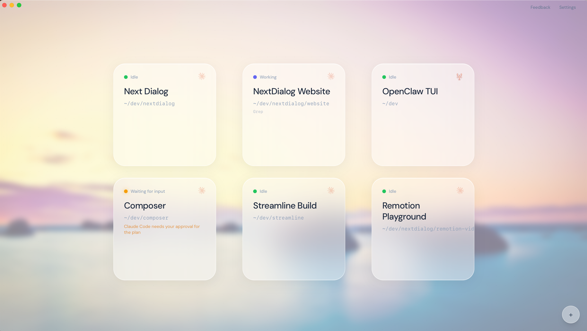
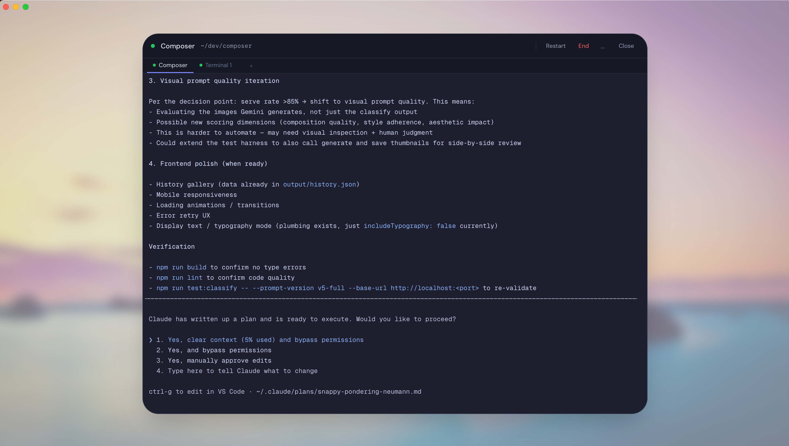

# NextDialog

**A calm interface for AI coding agents.**

[](https://github.com/brianwcline/nextdialog/actions/workflows/test.yml)
[](LICENSE)

---

<p align="center">
  
</p>

<p align="center">
  
</p>

---

## What it does

- **Multi-session terminal management** — Run multiple AI coding agents side by side. Claude Code, Codex, Aider, Gemini CLI, or any terminal-based tool.
- **Companion terminals** — Attach secondary terminals to any session for running tests, checking logs, or monitoring alongside your agent.
- **Session status detection** — Glanceable status dots show which sessions are working, which need your attention, and which are idle.
- **Context usage tracking** — See how much context window each agent session has consumed.
- **Return to calm** — One calm overview screen. Click in when needed. Press Escape to return. The gradient breathes. Nothing demands attention until something deserves it.

## Quick start

### Prerequisites

- [Node.js](https://nodejs.org/) 20+
- [Rust](https://www.rust-lang.org/tools/install) 1.75+
- Platform dependencies: see the [Tauri v2 prerequisites](https://v2.tauri.app/start/prerequisites/)

### Build & run

```bash
git clone https://github.com/brianwcline/nextdialog.git
cd nextdialog
npm install
npm run tauri dev
```

> **Note:** The first build compiles Rust dependencies and will take several minutes.

## Architecture

| Layer | Stack |
|-------|-------|
| Frontend | React 19, Tailwind CSS 4, xterm.js, Framer Motion |
| Backend | Tauri v2 (Rust), portable-pty for terminal multiplexing |
| Distribution | Tauri bundler — `.app` (macOS), `.deb`/`.AppImage` (Linux), `.exe` (Windows) |

## Telemetry

Community builds have **telemetry disabled by default**. No API credentials are baked into the binary unless explicitly provided at compile time.

Official release builds collect anonymous usage events (session lifecycle, feature usage) and opt-in feedback. No personally identifiable information is collected. See `src-tauri/src/telemetry.rs` for the full implementation.

## Download

Pre-built binaries for macOS (Apple Silicon & Intel), Linux, and Windows are available at [nextdialog.io](https://nextdialog.io) and on the [GitHub Releases](https://github.com/brianwcline/nextdialog/releases) page. macOS builds are signed and notarized.

## Philosophy

NextDialog is designed for how developers *feel*, not how computers perform. Every tool in the multi-agent space competes on features — more panels, more config, more density. NextDialog competes on calm.

## Known limitations

- **No auto-updater** — Manual downloads for now.

## License

[MIT](LICENSE) — Copyright (c) 2026 Brian Cline
